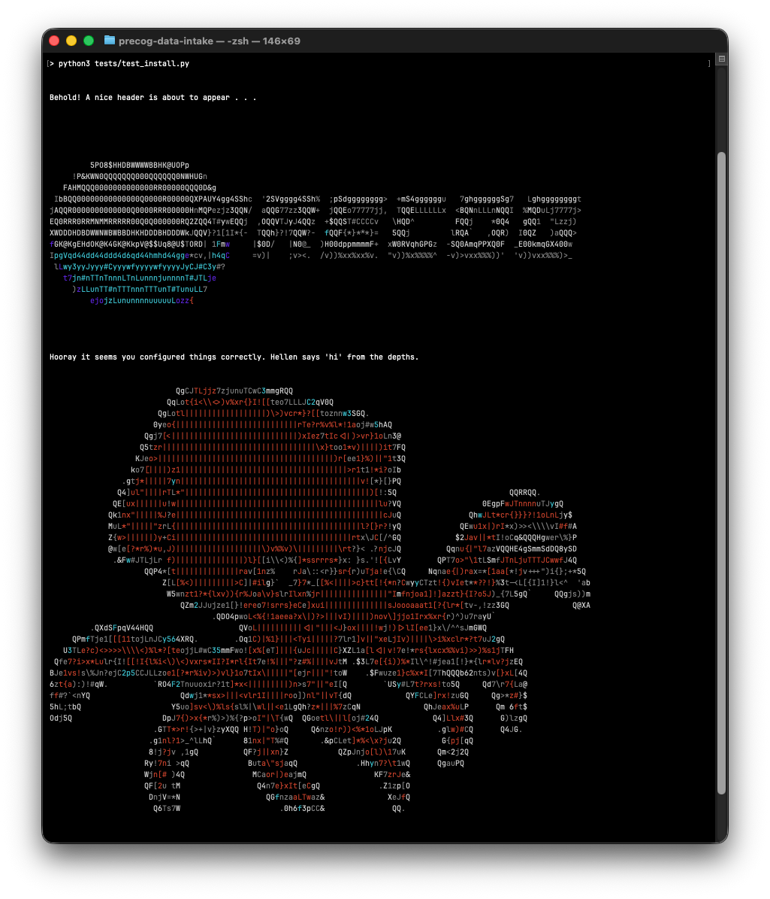

# precog-data-intake 🦑

Data sweep and scraping utilities for downloading and organizing Earth system data from the [Earth System Grid Federation](https://esgf-ui.ceda.ac.uk/search)) nodes based on core functionality from [esgf-intake](https://intake-esgf.readthedocs.io/en/latest/)

## Overview

This repository contains scripts and workflows to automate bulk discovery, file checking, validation and download of datasets from ESGF archives.
It is designed to support climate and oceanographic analyses that require consistent, reproducible access to large model and observational datasets.

## Features

- Automated search through the ESGF catalogue using project, variable, experiment, and temporal filters.
- Verification of continuity of date stamps in CMIP6 Pre-Industrial (PI) and Historical runs.
- Verification and logging of availability of (PI) and Historical runs on consistent grids (e.g., regular grid `gr` and native grid `gn`). 
- Export of simple Dataframes for realized ESGF catalogue searches.
- Verification of server responses and flagging shortlisted ESM outputs as 'Downloadable'.
- Combined conditional search for availability of PI and Historical runs in CMIP6 models across >1 variable (e.g., `expc` & `epc100`).
- Parallelized URL checking for fastest connection in case same data are available across different nodes.
- Batched download of files from multiple ESGF nodes with retry and integrity checks.
- Local directory layout optimized for downstream analysis tools.
- Batched search and download of grid cell measures (e.g., `areacello` and `volcello`) with archive snapshot of relaxed regex matches for CMIP6 models of interest.

## Installation

These instructions assume you have **Python 3.12+** installed and available as `python` or `python3` on your system.

### 1. Clone the repository

```bash
git clone https://github.com/precog-ocean/precog-data-intake.git
cd precog-data-intake
````
### 2. Create a virtual environment (named `venv`)
```bash
python3 -m venv .venv
````
Make sure your python version is >3.12.
You can check which python you have installed on your machine by typing `python` followed by `TAB` a few times. It will list your python versions.

The argument `.venv` means a hidden directory will be created under the project directory you are in, where python and its dependencies will be installed (i.e., `~/precog-data-intake/.venv`). 

### 3. Activate it
```bash
source .venv/bin/activate
```
When activation succeeds, your shell prompt will usually show the environment name in parentheses, for example `(.venv)...`

### 4. Upgrade pip (recommended)
Inside the activated virtual environment, upgrade `pip`:
```bash
python -m pip install --upgrade pip
```
### 5. Install dependencies
```bash 
pip install -r requirements.txt
```

## Checking installation

Make sure that you have activated the python virtual environment. Then run:

```bash 
python3 tests/test_install.py
```
If you see the PREGOC logo followed by Hellen, the vampire squid from hell, being printed on the terminal as shown in the example below, then you probably installed things correctly.


## Repository structure
```                
precog-data-intake/
├─.venv/                 # Hidden folder with virtual enviroment dependencies               
├─ intake_esgf_mods/     # Modified Python modules from the main package "esgf-intake"
├─ misc_images/          # Images (these are renderered as ASCII art headers and footers in the CLI)
├─ scripts/              # Main workflows to be run as command line scripts (see notebooks for examples)
├─ notebooks/            # Example notebooks of usage
└─ tests/                # Basic tests for core functionality
```

## Workflow

A Jupyter notebook [Workflow_Example_POCflux.ipynb](Workflow_Example_POCflux.ipynb) is provided, which demonstrates how to find amongst CMIP6 models those that contain both PI and Historical outputs for:

```
 'epc100' : Downward Flux of Particulate Organic Carbon at 100m depth [mol m-2 s-1]
 'expc' :   Downward Flux of Particulate Organic Carbon fully-resolved at depth [mol m-2 s-1]
```

This self-guided notebook also shows you how to automatically fetch corresponding ocean grid cell measure variables ```areacello``` and ```volcello``` for the selected models.
